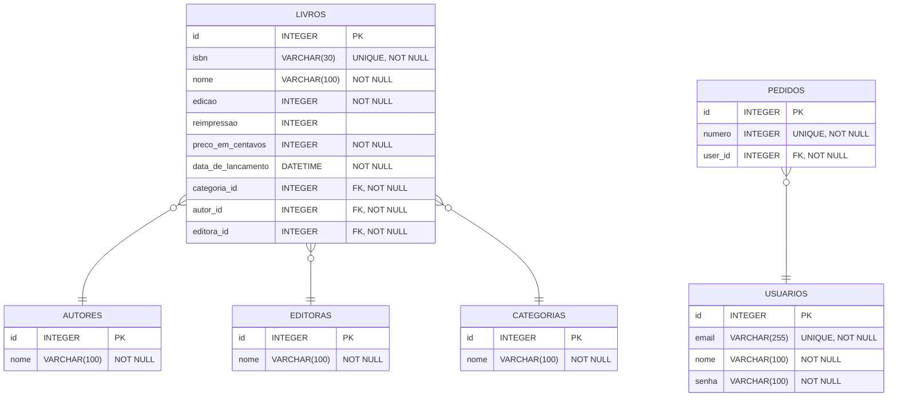

```mermaid
erDiagram
    USUARIOS {
        id INTEGER "PK"
        email VARCHAR(255) "UNIQUE, NOT NULL"
        nome VARCHAR(100) "NOT NULL"
        senha VARCHAR(100) "NOT NULL"
    }

    CATEGORIAS {
        id INTEGER "PK"
        nome VARCHAR(100) "NOT NULL"
    }

    AUTORES {
        id INTEGER "PK"
        nome VARCHAR(100) "NOT NULL"
    }

    EDITORAS {
        id INTEGER "PK"
        nome VARCHAR(100) "NOT NULL"
    }

    LIVROS {
        id INTEGER "PK"
        isbn VARCHAR(30) "UNIQUE, NOT NULL"
        nome VARCHAR(100) "NOT NULL"
        edicao INTEGER "NOT NULL"
        reimpressao INTEGER
        preco_em_centavos INTEGER "NOT NULL"
        data_de_lancamento DATETIME "NOT NULL"
        categoria_id INTEGER "FK, NOT NULL"
        autor_id INTEGER "FK, NOT NULL"
        editora_id INTEGER "FK, NOT NULL"
    }
    
    PEDIDOS {
        id INTEGER "PK"
        numero INTEGER "UNIQUE, NOT NULL"
        user_id INTEGER "FK, NOT NULL"
    }

    LIVROS }o--|| AUTORES : ""

    LIVROS }o--|| EDITORAS : ""

    LIVROS }o--|| CATEGORIAS : ""

    PEDIDOS }o--|| USUARIOS : ""

```
